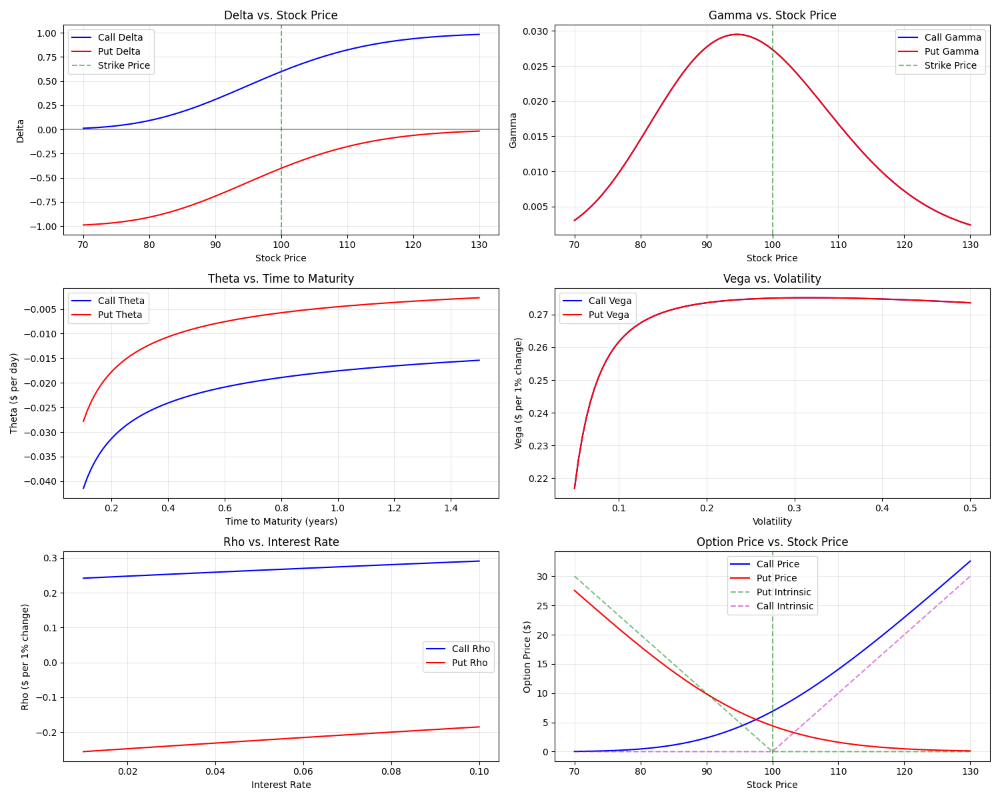

# Notes
- [Notes](#notes)
  - [1 Foundations](#1-foundations)
    - [1.1 Options Pricing](#11-options-pricing)
      - [Questions](#questions)
      - [1.1.1 Constant Volatility Models](#111-constant-volatility-models)
        - [1.1.1.1 Binomial Tree](#1111-binomial-tree)
        - [1.1.1.2 Black-Scholes](#1112-black-scholes)
        - [1.1.1.3 Monte Carlo](#1113-monte-carlo)
      - [1.1.2 Advanced Pricing Models](#112-advanced-pricing-models)
        - [1.1.2.1 Local Volatility](#1121-local-volatility)
          - [1.1.2.1.1 Dupire's Framework](#11211-dupires-framework)
          - [1.1.2.1.2 Calibration Methods](#11212-calibration-methods)
        - [1.1.2.2 Jump Processes](#1122-jump-processes)
          - [1.1.2.2.1 Merton Jump Diffusion](#11221-merton-jump-diffusion)
          - [1.1.2.2.2 Kou Double Exponential](#11222-kou-double-exponential)
        - [1.1.2.3 Stochastic Volatility](#1123-stochastic-volatility)
          - [1.1.2.3.1 Heston Model](#11231-heston-model)
          - [1.1.2.3.2 SABR Model](#11232-sabr-model)
          - [1.1.2.3.3 Rough Volatility](#11233-rough-volatility)
    - [1.2 Greeks](#12-greeks)
      - [Delta (Δ)](#delta-δ)
      - [Gamma (Γ)](#gamma-γ)
      - [Theta (Θ)](#theta-θ)
      - [Vega (ν)](#vega-ν)
      - [Rho (ρ)](#rho-ρ)
    - [1.3 Model Validation](#13-model-validation)
      - [1.3.1 Put Call Parity Test](#131-put-call-parity-test)
      - [1.3.2 Boundary Condition Tests](#132-boundary-condition-tests)
      - [1.3.3 Know Case Validation](#133-know-case-validation)
  - [2 Volatility Analysis](#2-volatility-analysis)
    - [Questions](#questions-1)
    - [2.1 Historical Volatility](#21-historical-volatility)
      - [2.1.1 Yang-Zhang Estimator](#211-yang-zhang-estimator)
    - [2.2 Volatility Models](#22-volatility-models)
      - [2.3.1 Moving Averages (EWMA)](#231-moving-averages-ewma)
      - [2.3.2 GARCH (GARCH(1,1), EGARCH, etc.)](#232-garch-garch11-egarch-etc)
      - [2.3.3 Stochastic Volatility](#233-stochastic-volatility)
        - [2.3.3.1 Heston Model](#2331-heston-model)
        - [2.3.3.2 SABR Model](#2332-sabr-model)
      - [2.3.4 Jump Diffusion Models](#234-jump-diffusion-models)
        - [2.3.4.1 Merton Jump Diffusion](#2341-merton-jump-diffusion)
        - [2.3.4.2 Bates Model](#2342-bates-model)
    - [2.3 Implied Volatility](#23-implied-volatility)
      - [2.3.1 Newton-Raphson Implementation](#231-newton-raphson-implementation)
      - [2.3.2 Initial Guess Optimization](#232-initial-guess-optimization)
      - [2.3.3 Handling Convergence Issues](#233-handling-convergence-issues)
      - [2.3.4 IV Surface Construction](#234-iv-surface-construction)
        - [2.3.4.1 Interpolation Methods](#2341-interpolation-methods)
        - [2.3.4.2 Arbitrage-Free Conditions](#2342-arbitrage-free-conditions)
  - [3 Model Validation and Analysis](#3-model-validation-and-analysis)
    - [Questions](#questions-2)
    - [3.1 Price Comparison](#31-price-comparison)
      - [3.1.1 Model vs Market](#311-model-vs-market)
      - [3.1.2 Outlier Analysis](#312-outlier-analysis)
    - [3.2 Sensitivity Analysis](#32-sensitivity-analysis)
      - [3.2.1 Stress Testing Framework](#321-stress-testing-framework)
      - [3.2.2 Parameter Impact Studies](#322-parameter-impact-studies)
  - [4 Trading Strategy Development](#4-trading-strategy-development)
  - [4.1 Arbitrage](#41-arbitrage)
  - [4.2 Greek-Based](#42-greek-based)
  - [5 Advanced Volatility Modeling](#5-advanced-volatility-modeling)
    - [5.1 GV(Graph Vol)](#51-gvgraph-vol)
      - [5.1.1 Term Structure Analysis](#511-term-structure-analysis)
      - [5.1.2 Strike Dependence](#512-strike-dependence)
      - [5.1.3 Surface Interpolation Methods](#513-surface-interpolation-methods)
    - [5.2 HVG](#52-hvg)
      - [5.1.1 Time Series Patterns](#511-time-series-patterns)
      - [5.1.2 Regime Detection](#512-regime-detection)
      - [5.1.3 Volatility Clustering](#513-volatility-clustering)
    - [5.3 GVV(Gamma-Vanna-Volga Implementation)](#53-gvvgamma-vanna-volga-implementation)
      - [5.3.1 Model Framework](#531-model-framework)
      - [5.3.2 Calibration Methods](#532-calibration-methods)
      - [5.3.3 Smile Dynamics](#533-smile-dynamics)
  - [6 Digital Asset Adjustments](#6-digital-asset-adjustments)
    - [6.1 Funding Rate Impact](#61-funding-rate-impact)
      - [6.1.1 Perpetuals](#611-perpetuals)
      - [6.1.2 Rate Adjustments](#612-rate-adjustments)
    - [6.2 Risk-Free Rate Calculation](#62-risk-free-rate-calculation)
      - [6.2.1 Lending and Staking Yield](#621-lending-and-staking-yield)
    - [6.3 Market Microstructure](#63-market-microstructure)
      - [6.3.1 Liquidity Analysis](#631-liquidity-analysis)
  - [X Volatility Surface Display?](#x-volatility-surface-display)
  - [X Possible Trading Strategies](#x-possible-trading-strategies)

## 1 Foundations

### 1.1 Options Pricing
This chapter focuses on the development of multiple pricing models for an European Option. In this chapter, we will design multiple models with different approaches to calculate the price of an European Option.

#### Questions
1. What are some of the pricing models used? What is the IV given the prices?

#### 1.1.1 Constant Volatility Models
##### 1.1.1.1 Binomial Tree
CRR Implementation
Adaptive Mesh Methods
##### 1.1.1.2 Black-Scholes
***European Put Option***
$$P(S,t) = Ke^{-r(T-t)}N(-d_2) - SN(-d_1)$$
***European Call Option***
$$C(S,t) = SN(d_1) - Ke^{-r(T-t)}N(d_2)$$

$$d_1 = \frac{\ln(S/K) + (r + \sigma^2/2)(T-t)}{\sigma\sqrt{T-t}}$$

$$d_2 = d_1 - \sigma\sqrt{T-t}$$

- $T$ is the expiration time (maturity date) (in years)
- $t$ is the current time (in years)

And $N(x)$ is the cumulative distribution function of the standard normal distribution:

$$N(x) = \frac{1}{\sqrt{2\pi}}\int_{-\infty}^{x}e^{-\frac{z^2}{2}}dz$$

***Model Assumptions***
1. The price of the underlying asset follows a geometric Brownian motion with constant drift and volatility
2. No arbitrage opportunities exist
3. It's possible to build a risk-free portfolio by combining the option and the underlying asset
4. Frictionless markets (no transaction costs or taxes)
5. Continuous trading is possible
6. The risk-free rate is constant and the same for all maturities
7. The underlying asset pays no dividends

***Limitation***
- Assumption of constant volatility (which doesn't match market reality)
- No consideration for dividends
- Assumes European-style options (cannot be exercised early)
- Assumes log-normal distribution of returns

##### 1.1.1.3 Monte Carlo
Basic Path Simulation
Variance Reduction Techniques

#### 1.1.2 Advanced Pricing Models
##### 1.1.2.1 Local Volatility
###### 1.1.2.1.1 Dupire's Framework
###### 1.1.2.1.2 Calibration Methods
##### 1.1.2.2 Jump Processes
###### 1.1.2.2.1 Merton Jump Diffusion
###### 1.1.2.2.2 Kou Double Exponential
##### 1.1.2.3 Stochastic Volatility
###### 1.1.2.3.1 Heston Model
###### 1.1.2.3.2 SABR Model
###### 1.1.2.3.3 Rough Volatility
<!-- ##### 1.2.4 Mixed Models
###### 1.2.4.1 Stochastic Volatility with Jumps
###### 1.2.4.2 Regime-Switching Extensions -->
<!-- 1.4 Machine Learning Approaches
Neural Network Models
Deep Hedging
Neural SDE Solvers
Hybrid ML-Statistical Models
NN-Enhanced GARCH
Volatility Forecasting Networks
 -->
<!-- 1.5 Cryptocurrency-Specific Considerations
Heavy-Tailed Distributions
Student-t Models
Alpha-Stable Distributions
Market Microstructure Effects
Funding Rate Impact
Cross-Exchange Dynamics
Regime Detection
Volatility Regime Switching
Market State Classification -->

### 1.2 Greeks 

#### Delta (Δ)
- **Call**: $\Delta_{\text{call}} = \frac{\partial C}{\partial S} = N(d_1)$
- **Put**: $\Delta_{\text{put}} = \frac{\partial P}{\partial S} = N(d_1) - 1 = -N(-d_1)$
- *Interpretation*: Sensitivity to changes in the underlying price

#### Gamma (Γ)
- **Call**: $\Gamma_{\text{call}} = \frac{\partial^2 C}{\partial S^2} = \frac{N'(d_1)}{S\sigma\sqrt{T-t}}$
- **Put**: $\Gamma_{\text{put}} = \frac{\partial^2 P}{\partial S^2} = \frac{N'(d_1)}{S\sigma\sqrt{T-t}}$
- *Interpretation*: Rate of change of Delta (same for calls and puts)

#### Theta (Θ)
- **Call**: $\Theta_{\text{call}} = \frac{\partial C}{\partial t} = -\frac{S\sigma N'(d_1)}{2\sqrt{T-t}} - rKe^{-r(T-t)}N(d_2)$
- **Put**: $\Theta_{\text{put}} = \frac{\partial P}{\partial t} = -\frac{S\sigma N'(d_1)}{2\sqrt{T-t}} + rKe^{-r(T-t)}N(-d_2)$
- *Interpretation*: Sensitivity to the passage of time

#### Vega (ν)
- **Call**: $\text{Vega}_{\text{call}} = \frac{\partial C}{\partial \sigma} = S\sqrt{T-t}N'(d_1)$
- **Put**: $\text{Vega}_{\text{put}} = \frac{\partial P}{\partial \sigma} = S\sqrt{T-t}N'(d_1)$
- *Interpretation*: Sensitivity to volatility (same for calls and puts)

#### Rho (ρ)
- **Call**: $\rho_{\text{call}} = \frac{\partial C}{\partial r} = K(T-t)e^{-r(T-t)}N(d_2)$
- **Put**: $\rho_{\text{put}} = \frac{\partial P}{\partial r} = -K(T-t)e^{-r(T-t)}N(-d_2)$
- *Interpretation*: Sensitivity to interest rates

Where:
- $N(x)$ is the standard normal cumulative distribution function
- $N'(x) = \frac{1}{\sqrt{2\pi}}e^{-\frac{x^2}{2}}$ is the standard normal probability density function
- $d_1 = \frac{\ln(S/K) + (r + \sigma^2/2)(T-t)}{\sigma\sqrt{T-t}}$
- $d_2 = d_1 - \sigma\sqrt{T-t}$

### 1.3 Model Validation
#### 1.3.1 Put Call Parity Test
#### 1.3.2 Boundary Condition Tests
#### 1.3.3 Know Case Validation

## 2 Volatility Analysis
### Questions
1. How Realized Volatility affects the pricing models? 
2. Volatility Models and how they affect pricing?

### 2.1 Historical Volatility

#### 2.1.1 Yang-Zhang Estimator

$$\sigma^2_{YZ} = \sigma^2_o + k\sigma^2_c + (1-k)\sigma^2_{RS}$$

where $k=0.34$

***1 Overnight Volatility***
The overnight component captures the variance of overnight returns:

$$\sigma^2_o = \frac{1}{n-1} \sum_{i=1}^n (u_i - \bar{u})^2$$

where:
- $u_i = \ln(\frac{O_i}{C_{i-1}})$
  - $O_i$ is the opening price on day i
  - $C_{i-1}$ is the closing price on day i-1
- $\bar{u} = \frac{1}{n} \sum_{i=1}^n u_i$
  - n is the number of observations

***2 Open-to-Close Volatility***
The open-to-close component measures intraday volatility:

$$\sigma^2_c = \frac{1}{n-1} \sum_{i=1}^n (c_i - \bar{c})^2$$

where:
- $c_i = \ln(\frac{C_i}{O_i})$
  - $C_i$ is the closing price on day i
  - $O_i$ is the opening price on day i
- $\bar{c} = \frac{1}{n} \sum_{i=1}^n c_i$

***3 Rogers-Satchell Volatility***
The Rogers-Satchell component accounts for drift in the price process:

$$\sigma^2_{RS} = \frac{1}{n} \sum_{i=1}^n [\ln(\frac{H_i}{C_i})\ln(\frac{H_i}{O_i}) + \ln(\frac{L_i}{C_i})\ln(\frac{L_i}{O_i})]$$

where:
- $H_i$ is the high price on day i
- $L_i$ is the low price on day i
- $O_i$ is the opening price on day i
- $C_i$ is the closing price on day i

***Standard Error***

$$SE(\sigma_{YZ}) = \sigma_{YZ} \sqrt{\frac{1}{2n}}$$

***Adjusting for different exchanges***

$$\sigma^2_{YZ,weighted} = \sum_{j=1}^m w_j \sigma^2_{YZ,j}$$

where:
- $w_j = \frac{V_j}{\sum_{k=1}^m V_k}$
  - $V_j$ is the volume on exchange j
  - m is the number of exchanges
<!-- 1. Traditional
   1. Close-to-Close (Historical Volatility)
   2. Parkinson Estimator (1980)
   3. Garman-Klass Estimator (1980)
   4. Rogers-Satchell Estimator (1991)
   5. Yang-Zhang Estimator (2000) - Optimal -->
<!-- 2. High Frequency
   1. Basic Realized Volatility
   2. Two-Scales Realized Volatility (TSRV)
   3. Realized Kernel -->

### 2.2 Volatility Models
#### 2.3.1 Moving Averages (EWMA)
#### 2.3.2 GARCH (GARCH(1,1), EGARCH, etc.)
#### 2.3.3 Stochastic Volatility
##### 2.3.3.1 Heston Model
##### 2.3.3.2 SABR Model

#### 2.3.4 Jump Diffusion Models
##### 2.3.4.1 Merton Jump Diffusion
##### 2.3.4.2 Bates Model

### 2.3 Implied Volatility
#### 2.3.1 Newton-Raphson Implementation
#### 2.3.2 Initial Guess Optimization
#### 2.3.3 Handling Convergence Issues
#### 2.3.4 IV Surface Construction
##### 2.3.4.1 Interpolation Methods
##### 2.3.4.2 Arbitrage-Free Conditions

## 3 Model Validation and Analysis

### Questions
1. Are the prices / IV compared to the quoted price different? 
2. Is there a model that prices the closest to the quoted price?
3. Are there any times where the model prices the instrument differently from the quoted prices (outliers)?

### 3.1 Price Comparison
#### 3.1.1 Model vs Market
***Error Metrics***
1. Mean Square Error (MSE)
2. Root Mean Square Error (RMSE)
3. Mean Absolute Percentage Error (MAPE)

***Difference***

#### 3.1.2 Outlier Analysis

### 3.2 Sensitivity Analysis 
#### 3.2.1 Stress Testing Framework
#### 3.2.2 Parameter Impact Studies

## 4 Trading Strategy Development
## 4.1 Arbitrage
Put-Call Parity
Volatility Arbitrage

## 4.2 Greek-Based
Delta-Neutral Strategies
Volatility Trading
Delta Hedging

## 5 Advanced Volatility Modeling
### 5.1 GV(Graph Vol) 
It allows you to plot implied volatility surfaces and term structures, helping traders understand how volatility varies across different strike prices and expiration dates.

#### 5.1.1 Term Structure Analysis
#### 5.1.2 Strike Dependence
#### 5.1.3 Surface Interpolation Methods

### 5.2 HVG
This shows historical volatility patterns over time. It's crucial for comparing current implied volatility levels against historical realized volatility, which helps in determining if options are relatively expensive or cheap.

#### 5.1.1 Time Series Patterns
#### 5.1.2 Regime Detection
#### 5.1.3 Volatility Clustering

### 5.3 GVV(Gamma-Vanna-Volga Implementation)
Inspriation: [GVV (gamma-vanna-volga) modeling by @bennpeifert](https://x.com/bennpeifert/status/1888254737075835311)

#### 5.3.1 Model Framework
#### 5.3.2 Calibration Methods
#### 5.3.3 Smile Dynamics

## 6 Digital Asset Adjustments
### 6.1 Funding Rate Impact
#### 6.1.1 Perpetuals
#### 6.1.2 Rate Adjustments

### 6.2 Risk-Free Rate Calculation
#### 6.2.1 Lending and Staking Yield

### 6.3 Market Microstructure
#### 6.3.1 Liquidity Analysis

## X Volatility Surface Display?

## X Possible Trading Strategies
This chapter focuses on using the information from the previous chapters to generate a trading strategy that exploits market inefficiencies. Can we use the model to generate a trading strategy based on the mispricing?